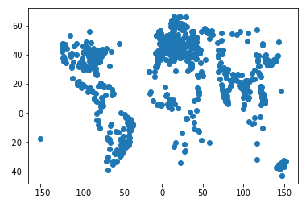

# Assignment 8 - Spatial data and Magic: The Gathering

## 2-d plot of the latitude and longitudes of the 1000 largest populations from the `geonames` table

## Histogram that counts the number of cards for each color
